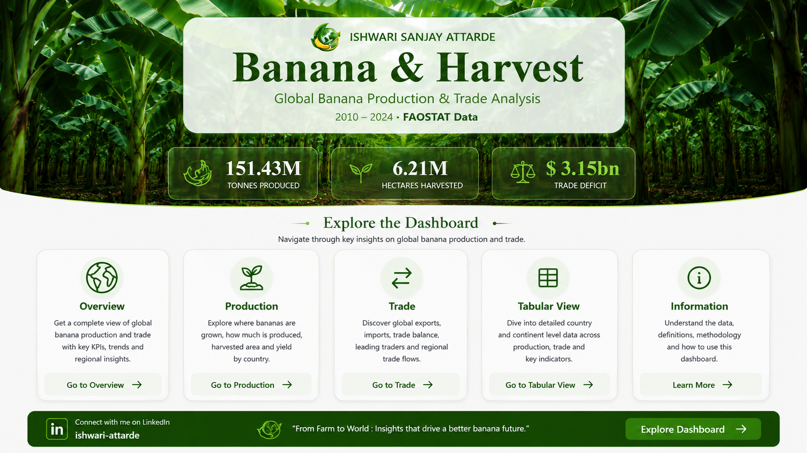
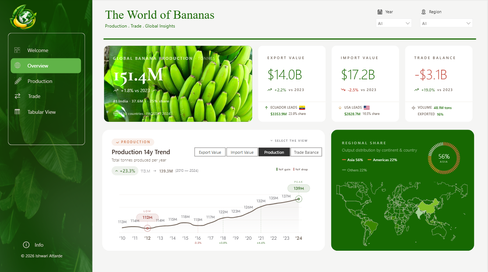
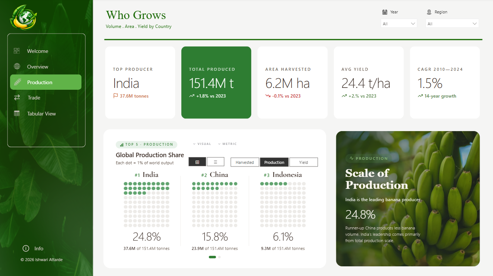
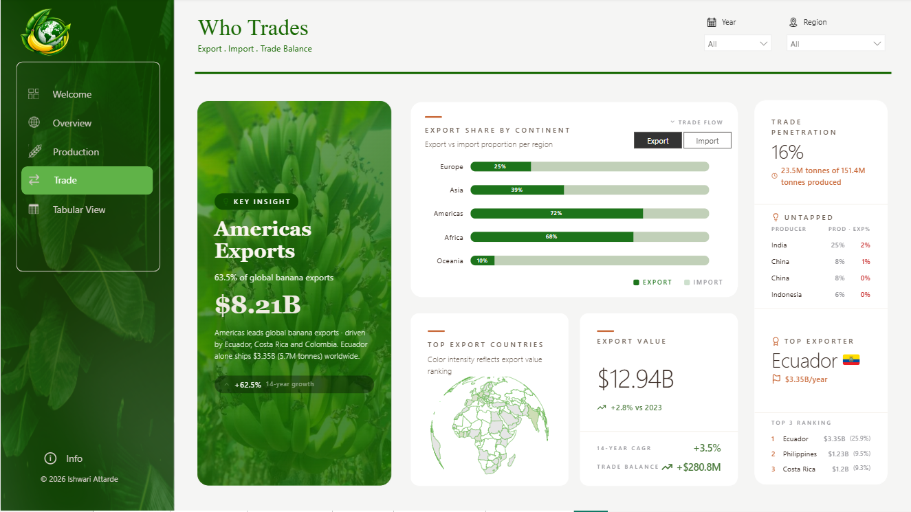
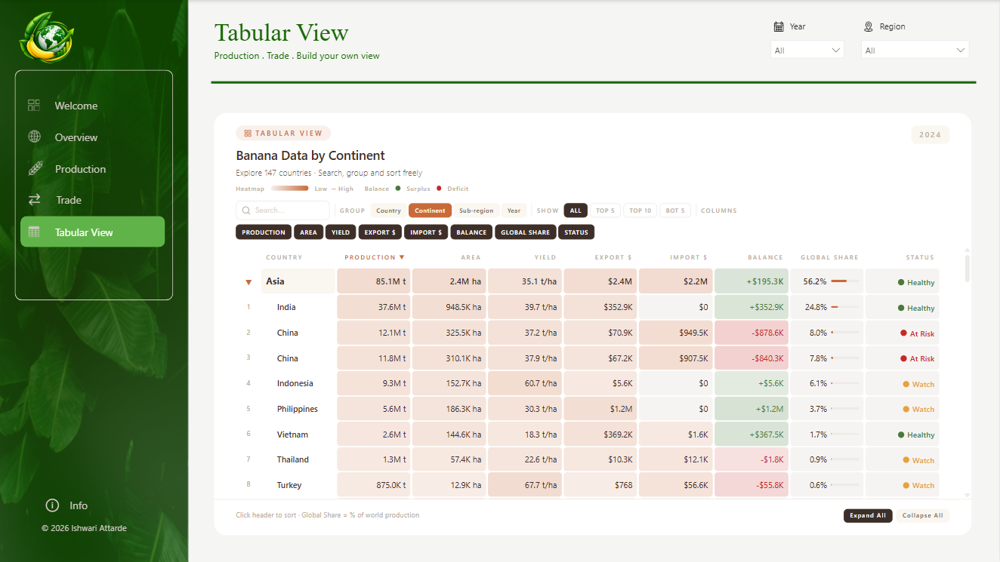
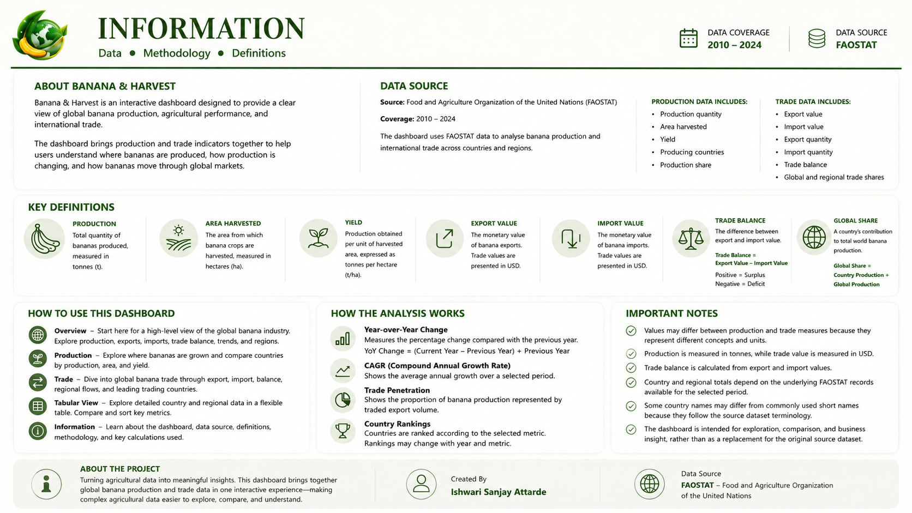

# 🍌 Banana & Harvest — Global Banana Production & Trade Analysis

An interactive Power BI dashboard that turns 15 years of FAOSTAT agricultural data into a clear, explorable view of how the world grows, harvests, and trades bananas.



<p align="center">
  
  
  
  
</p>

<p align="center">
  <a href="https://app.powerbi.com/view?r=eyJrIjoiMmQxODA1MDktNDQ1MC00NTQ3LWJlMWUtNWU4OGNiOWI2NmNhIiwidCI6ImM5YzUwODQ4LWIwM2EtNGJlNC1iNjU1LTZlZGQ3ZmI4MWM1YSJ9">
    
  </a>
</p>

---

## 📖 Overview

**Banana & Harvest** brings together global banana **production** and **trade** indicators in one interactive experience — helping users understand where bananas are grown, how production is changing, and how bananas move through global markets.

The dashboard uses FAOSTAT data (2010–2024) to analyze production and trade across **147 countries** and regions, combining KPIs, trend analysis, country rankings, and a fully flexible tabular explorer.

**Author:** Ishwari Sanjay Attarde
**Connect:** [LinkedIn – ishwari-attarde]([https://www.linkedin.com/in/ishwari-attarde](https://www.linkedin.com/in/ishwariattarde/))

🔗 **[Open the Live Interactive Dashboard →](https://app.powerbi.com/view?r=eyJrIjoiMmQxODA1MDktNDQ1MC00NTQ3LWJlMWUtNWU4OGNiOWI2NmNhIiwidCI6ImM5YzUwODQ4LWIwM2EtNGJlNC1iNjU1LTZlZGQ3ZmI4MWM1YSJ9)**
No installation needed — explore production, trade, and country-level data directly in your browser.

---

## ✨ Key Highlights

| Metric | Value |
|---|---|
| 🍌 Total Production | **151.4M tonnes** |
| 🌱 Area Harvested | **6.21M hectares** |
| ⚖️ Trade Deficit | **-$3.15B** |
| 📤 Export Value | **$14.0B** |
| 📥 Import Value | **$17.2B** |
| 🏆 Top Producer | **India** — 37.6M t (24.8% global share) |
| 🌍 Top Exporter | **Ecuador** — $3.35B/year (23.9% share) |
| 📈 Production CAGR (2010–2024) | **+1.5%** |

---

## 🗂️ Dashboard Pages

### 1. Overview — *The World of Bananas*
A high-level snapshot of the global banana industry: production trends, export/import value, trade balance, and regional production share on an interactive world map.



### 2. Production — *Who Grows*
Explore where bananas are grown and compare countries by production volume, harvested area, and yield. Includes top-5 producer breakdowns and a 2010–2024 CAGR view.



### 3. Trade — *Who Trades*
Dive into global banana trade flows — export share by continent, top exporting countries, trade penetration rate, and untapped producer opportunities.



### 4. Tabular View — *Build Your Own View*
A fully flexible, sortable, searchable table for comparing countries and continents across production, area, yield, export/import value, trade balance, and global share — with a built-in health-status heatmap (Healthy / Watch / At Risk).



### 5. Information — *Data, Methodology & Definitions*
Documents the data source, coverage, key definitions, and calculation methodology used throughout the dashboard.



---

## 📊 Data Source

| | |
|---|---|
| **Source** | [FAOSTAT](https://www.fao.org/faostat/en/) — Food and Agriculture Organization of the United Nations |
| **Coverage** | 2010 – 2024 |
| **Scope** | 147 countries and regions |

**Production data includes:** production quantity, area harvested, yield, producing countries, production share
**Trade data includes:** export value & quantity, import value & quantity, trade balance, global & regional trade shares

---

## 📐 Key Definitions & Calculations

| Term | Definition |
|---|---|
| **Production** | Total quantity of bananas produced, measured in tonnes (t) |
| **Area Harvested** | The area from which banana crops are harvested, measured in hectares (ha) |
| **Yield** | Production obtained per unit of harvested area (t/ha) |
| **Export / Import Value** | Monetary value of banana exports/imports, presented in USD |
| **Trade Balance** | `Export Value − Import Value` — positive = surplus, negative = deficit |
| **Global Share** | `Country Production ÷ Global Production` |
| **YoY Change** | `(Current Year − Previous Year) ÷ Previous Year` |
| **CAGR** | Compound Annual Growth Rate — average annual growth over a selected period |
| **Trade Penetration** | Proportion of banana production represented by traded export volume |

---

## 🛠️ Tech Stack

- **Power BI Desktop** — data modeling, DAX measures, and visualization
- **FAOSTAT (CSV)** — raw production and trade datasets
- **Power Query** — data cleaning and transformation

---

## 📁 Repository Structure

```
banana-and-harvest/
├── assets/
│   ├── landing_page.png
│   ├── overview_page.png
│   ├── production_page.png
│   ├── trade_page.png
│   ├── tabular_page.png
│   └── information_page.png
├── data/
│   ├── Banana_Production.csv     # FAOSTAT production data (2010–2024)
│   ├── Banana_Trade.csv          # FAOSTAT trade data (2010–2024)
│   ├── countries.xlsx            # Country / region reference table
│   └── Year.xlsx                 # Year reference table
├── Banana_and_Harvest.pbix       # Power BI dashboard file
└── README.md
```

---

## 🚀 Getting Started

### Option A — View it live (no install required)
Just open the **[live Power BI dashboard](https://app.powerbi.com/view?r=eyJrIjoiMmQxODA1MDktNDQ1MC00NTQ3LWJlMWUtNWU4OGNiOWI2NmNhIiwidCI6ImM5YzUwODQ4LWIwM2EtNGJlNC1iNjU1LTZlZGQ3ZmI4MWM1YSJ9)** in your browser and start exploring.

### Option B — Run it locally in Power BI Desktop
1. **Clone the repository**
   ```bash
   git clone https://github.com/<your-username>/banana-and-harvest.git
   cd banana-and-harvest
   ```
2. **Open the dashboard**
   Open `Banana_and_Harvest.pbix` in [Power BI Desktop](https://powerbi.microsoft.com/desktop/) (free).
3. **Refresh the data** (optional)
   The raw CSV/XLSX files are in `/data`. Update the file paths in Power Query if you relocate them, then click **Refresh**.
4. **Explore**
   Use the **Year** and **Region** filters on any page to slice the data, and the **Tabular View** page to build custom country/continent comparisons.

---

## 💡 Notable Insights

- **Asia dominates production**, contributing **56%** of world output, led by India (24.8%) and China (15.8%).
- **The Americas dominate exports**, accounting for **63.5%** of global banana exports ($8.21B), driven by Ecuador, Costa Rica, and Colombia.
- **Ecuador is the world's top exporter**, shipping **$3.35B** (5.7M tonnes) annually — a **+62.5%** increase over 14 years.
- Despite leading production, **only 16%** of global banana output (23.5M of 151.4M tonnes) is actually traded internationally — most production is consumed domestically.
- The world ran a **-$3.1B banana trade deficit** in the latest year, up **19.0%** year-over-year.

---

## ⚠️ Important Notes

- Production is measured in **tonnes**; trade value is measured in **USD** — the two are not directly comparable.
- Country and regional totals depend on the underlying FAOSTAT records available for the selected period.
- Some country names follow FAOSTAT source terminology and may differ from commonly used short names.
- This dashboard is intended for **exploration, comparison, and business insight** — not as a replacement for the original FAOSTAT dataset.

---

## 👤 Author

**Ishwari Sanjay Attarde**
📌 [LinkedIn]([https://www.linkedin.com/in/ishwari-attarde](https://www.linkedin.com/in/ishwariattarde/))

> *"From Farm to World: Insights that drive a better banana future."*

---


